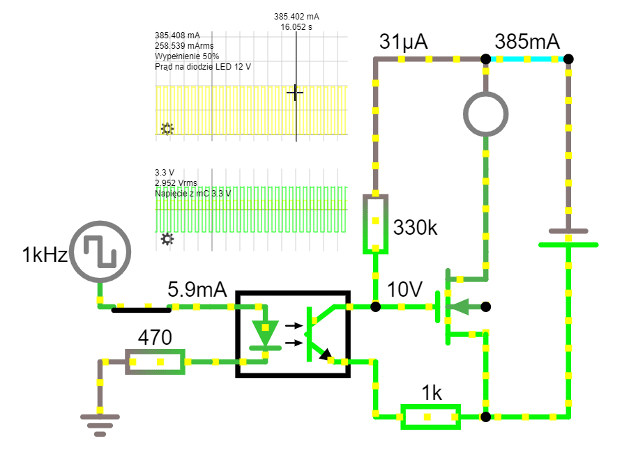

# Night Rays 
[ Optoizolacja sygnałów sterujących 3.3V od zasilających 12V

](https://www.falstad.com/circuit/circuitjs.html?ctz=CQAgjCAMB0l5BOJyWoVWCBMcAs+xcA2LBAZizNxF0hAFYayAoAZxoSPCLvwA5udISABmAQwA2rAKbMAbiADsObkpVYs1YbXBYo+mPWa1FDMHrA8zejdTDMATiCLKQt55AHu6YeI+vg2DS4AmBBvIqQ-jyhVjHOWiBkZPBRlnouenx0map6ACbS4gCuEgAuALQS0vngdRAw5swA7h6hQfHezCIJPnGulnScbhiQWMwASsGxvCG6AnQW8EnQZAYYRgDm04F6-G6aUC3OA1xEOpZHred9bar216dqtw93g72Cbse5hNQ-WAtvgNFGdXF1HjZDspFocotdPAk3lw4ScsjkBgCjrQ1iFhPQOokwGQAPpgYmQYn0Ci4BDk2DwBBgej0LCKKhkRT0Ol8cnErCkkkkgAKDkAoID5AA6rAAdmIpfkAJYAe3yAC8FdIpQAZACiABEpeYpQA1Y40rjvejmT72bE0bIgB34iyYxZkskUvg8Mhcoh0sZcin8rBkkkAOTEAAcFYBMQAAxhqpaqpQBbADCUrIqxNzCVjrqdCtGjcQmgDRGAhYeYg5fMcHODAwNZGECr4Ds+nouCpEBUMFSCBB9BIjBs7aSzCAA)

### Liniowe sterowanie jasnością podświetlenia
```m
y = ax2 +bx +c
```

#### Do wdrożenia sterowanie
- automatyczne/fabryczne (safety default)
- dyskretne (lookuptable na żądanie)
- ciągłe, pomiar i korekcja przy każdym rozświetleniu

Historia:
:1: Poniedziałek: Test sprawności transoptora [PC618](docs/PC817.pdf) i mosfetów [IRF540N](docs/irf540n.pdf)
- Wtorek  Dobór rezystorów
- Środa- Programowanie mikrokontrolera
- Czwartek- Zastosowanie
- Piątek testy

Java version
http://www.falstad.com/mathphysics.html

JS version
http://lushprojects.com/circuitjs/circuitjs.html

