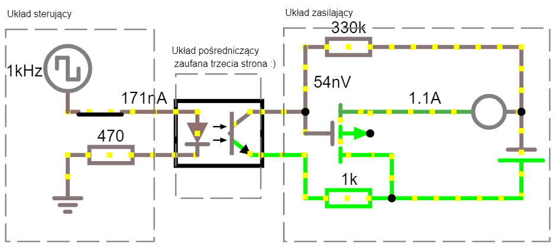
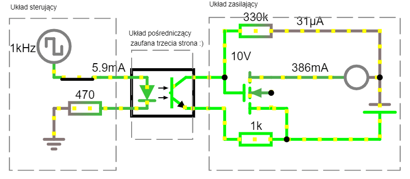
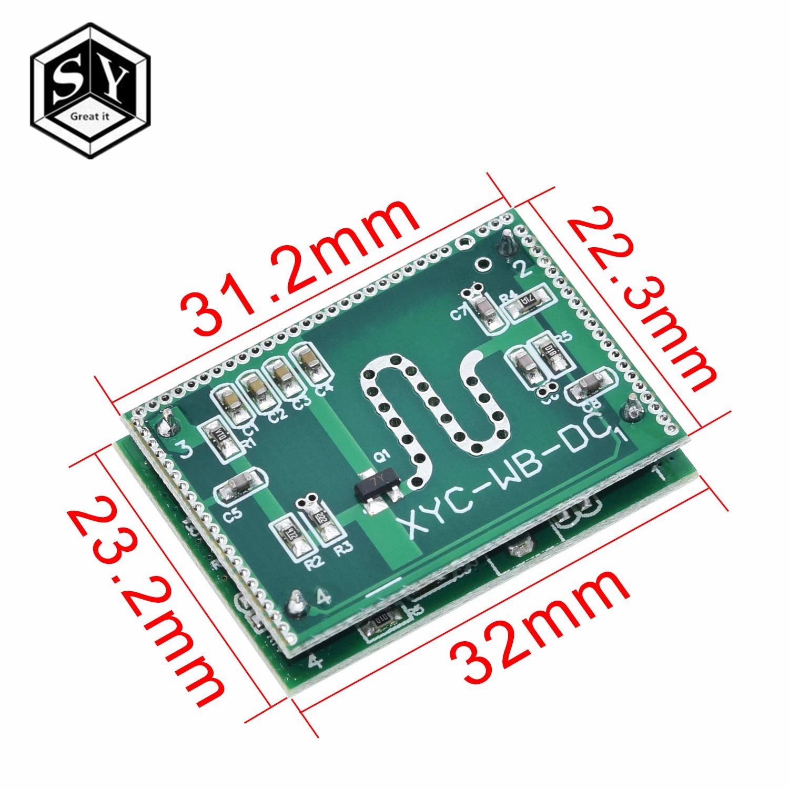

# Night Rays 
> Hipoteza: Wprowadzenie pośrednika podności czy obniża funkcyjność układu?

Cele projektowe:

1. Prostota
2. Niezawodność
3. Kontaktowość, czyli wykorzystanie tanich i popularnych elementów wykonawczych (analogowych) oraz sterujących (cyfrowych)

### Projekt cyfrowy (sterowanie wypełnieniem)

> [ Schemat optoizolacji sygnałów sterujących 3.3V od zasilających 12V P-Mosfet

](https://www.falstad.com/circuit/circuitjs.html?ctz=CQAgjCAMB0l5BOJyWoVWCBMcAs+xcA2LBAZizNxDPQFYQ6iAoAZxFwSPCMg9wAcPPiJAAzAIYAbVgFNmANxAB2AdTC8VakFizVRuPmCxRTMOs0PLGx4TZO71zAE4giAoY7d6dPo-Bd7cGx+ITAQvlxlSECSdVt3MNs+MjJ4GI0TZTJuDT5VdU0TABNZSQBXKQAXAFopWWLwJogYY2YAd291ELjffWYAJVC7fDCsIT4TMHhwaDDoBhEF5gBzYfCTUb6oDpUc8ASPA5MYzsS7bNzNMF2iZSmeo42ds6Ove8m-S0gyN0gw7gCOBufQHAD6YDBkDBdAonChsHgCDAdDoWGyuDIyjoYKI0FwULBWAhkLIYIACs5AKCAxQAOqwAHYSenFACWAHtigAvVmyekAGQAogARenGekANV2nCufDotjy4G+v0MRm4aKERFBKIhhIEvDIOKICMgWBx0OJOrJADkJAAHVmATEAAMa8+lc+kAWwAwvSyNAyJLmAAjIJm7iGExIHahjXbOjI8AUHYADw4PxACEidD45A4KhAAFUANaAIUAJHTWKwqrJnOUAFZU50AT2Yad46AE6CICczmwLJfLla5ElYrKkEkbLbbjDNB2svCmaXz1kHFfpdvZgG1AZwNBms51cpvN2m0hnuiTlSRM+lVZxc2Su5lVu-sm+sABcAEpdh9tgVtlOLo7F6MBbCwX99jArJtGgl4tHiGDChEW5-mCExQIiW4fEVUDlG4IC8O4LUjHw+Dzmec4vEI+4QKeTRCLQ3CcIYkM-k8JgQCBBgEAmZgxBBUjiNosAyOmBgwAWDBTWYdkdF+FpGFwWEIBwaS4HCFS50meSaGYIA)
>
> W celu uniknięcia rozbłysków przy przerwach w zasilaniu, próba rozwiązania przez zastosowanie tranzystora typu **p**rzewodzącego (domyślna logika układu sterującego to stan niski) **Próba zakończona nieppowodzeniem**

[ Optoizolacja sygnałów sterujących 3.3V od zasilających 12V
 
](https://www.falstad.com/circuit/circuitjs.html?ctz=CQAgjCAMB0l5BOJyWoVWCBMcAs+xcA2LBAZizNxF0hAFYayAoAZxoSPCLvwA5udISABmAQwA2rAKbMAbiADsfamB5KVILFmrDa4LFCMx6zWooZhDauvStad4ZgCcQRPgO3US1L0bDwLpbW2DS4AmChvIqQQT7g9u4R9nRkZPCxaoaKZFw2GqrqhgAm0uIArhIALgC0EtLF4E0QMFbMAO5ujpGG8X6xIm76YIpcRIrWoyCcWhiQWMwASmER6vwGAnTW8ODQEdCMQgfMAOYr4KHr-R1KuQm9HvdQN0mCt3nqYC8TFw8RUS9Hn4JltHLFaGQ3JBViA+HAhv4sAB9MBIyBI+gUXAINGweAIMD0ehYHK4MiKei4vhopHIqxIshIgAKzkAoIDFAA6rAAdmIucUAJYAe2KAC8BdIuQAZACiABEuVYuQA1G7Yj62ez5L4QmjwtTBWHCNQoml8HhkSlEXHzSnounWxkAOTEAAcBYBMQAAxhKuaKuQBbADCXLI0DIKuYACNDVh6FxaIYkM8Y8TPI56ATwBRngAPPWQhC8eh0cg0JQgACqAGtAEKAYk5rFYVWkznKACtWV6AJ7MfM8AR8CxEegCIvliw1+uN0ViVgCiRiTs9vsMOMJYfzbO8CtThtc11CwDagM4GtyBV7RV3uxyOdy-WJyuJeVyqs5RdIfXym2+hS-WAAXAAlDcIIONQyi+GCLzdOo8RgPYCydDkeT2JBTyxMhmgIdk2HqJhUL-L03QAp08Fwd0UwEfBUxEMMVGAkRbhAtBZE-Pkrz5NR0JvORQjRoRWjxkajAIJszBCrCTSatoWhHC0swCCwkndEY9C4JiEA4HMcCRJp65aVo1AsEAA)


## ToDo

### Projekt analogowy (niezależy układ punktowy, samokontrolujący)

### Liniowe sterowanie jasnością
```m
y = ax2 +bx +c
```

### Wdrożenie sterowania
- automatyczne/fabryczne (safe default)
- dyskretne (lookuptable na żądanie)
- ciągłe, pomiar i korekcja przy każdym rozświetleniu

## FAQ

- What is [gamma correction](docs/led-tricks-gamma-correction.pdf)?

- Pinout 
[ESP8266 nodemcu v2](docs/esp8266-nodemcu-dev-kit-v2-pins.png) and
[Blue Pill STM32f103](docs\stm32f103c8t6_pinout_voltage01.png)
Boards up to 2$
- Making circuits free
[LTspice](https://www.analog.com/en/design-center/design-tools-and-calculators/ltspice-simulator.html#) [MultisimLive](https://www.multisim.com)  
[Falstad Java version](http://www.falstad.com/mathphysics.html)
[Transpiled LushProjects JS version](http://lushprojects.com/circuitjs/circuitjs.html)

- Czujka ruchu (o odpowiedzi stanu dyskretnego) [XYC-WB-DC Sensor up to 2$](https://pl.aliexpress.com/item/4000027303600.html?src=google&albch=shopping&acnt=494-037-6276&isdl=y&slnk=&plac=&mtctp=&albbt=Gploogle_7_shopping&aff_atform=google&aff_short_key=UneMJZVf&&albagn=888888&albcp=6459787116&albag=77066918093&trgt=883147839979&crea=pl4000027303600&netw=u&device=c&albpg=883147839979&albpd=pl4000027303600&gclid=CjwKCAiAtK79BRAIEiwA4OskBg9nx7xN_k1haTV1RzlB2w8ldtXYYG0JT0f7hNuDv45lhu8bPN5QYRoC15UQAvD_BwE&gclsrc=aw.ds)


Transient?

### Historia
- Poniedziałek - Test sprawności transoptora [PC817](docs/PC817.pdf) i mosfetów [IRF540N](docs/irf540n.pdf) lub IRL2203 (Tranzystor bez konieczności separacji logiki mikrokontrolera)
- Wtorek - Dobór rezystorów
- Środa - Programowanie mikrokontrolera
- Czwartek - Zastosowanie
- Piątek - testy


### Literatura 
- [Superkondensatory chronią węzły IoT przed utratą zasilania](https://elektronikab2b.pl/technika/52804-superkondensatory-chronia-wezly-iot-przed-utrata-zasilania)

- [ Make sure your optocoupler is properly biased](https://www.edn.com/power-tips-81-make-sure-your-optocoupler-is-properly-biased/)

# Warstwa fizyczna rzeczywista

